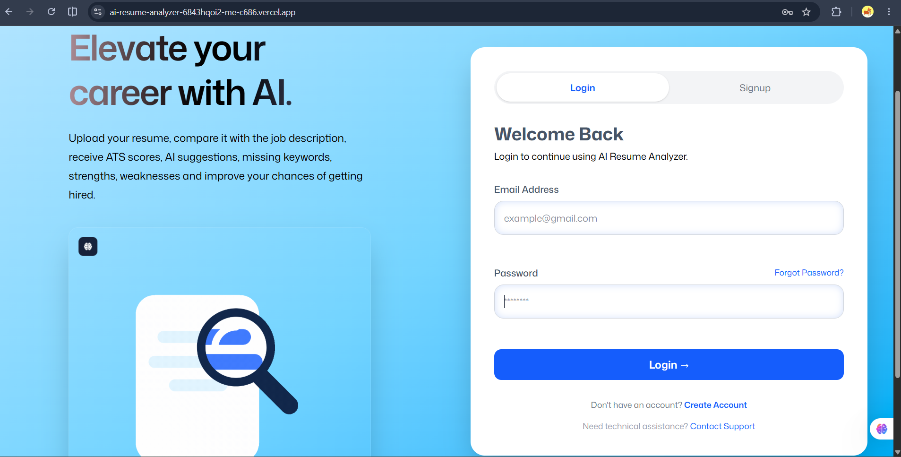
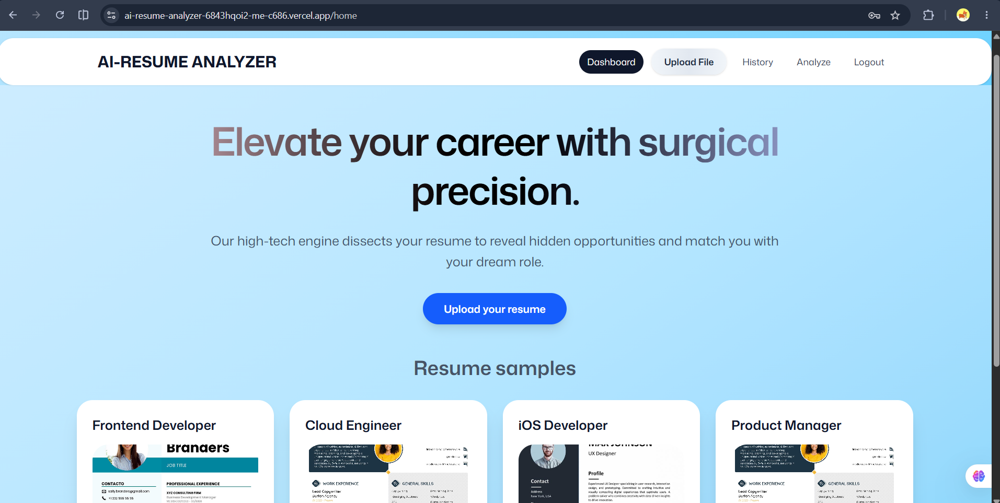
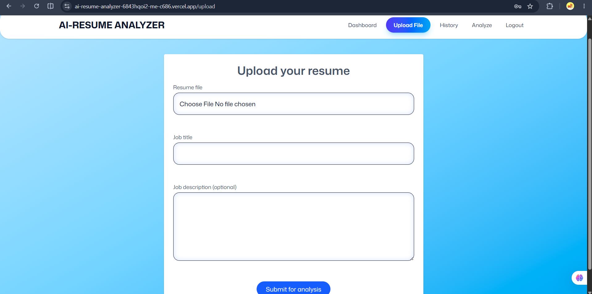
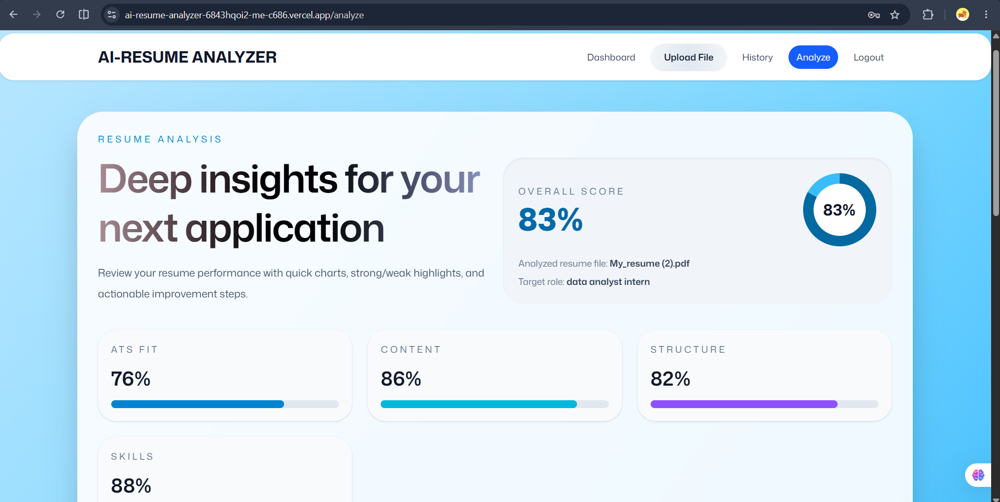
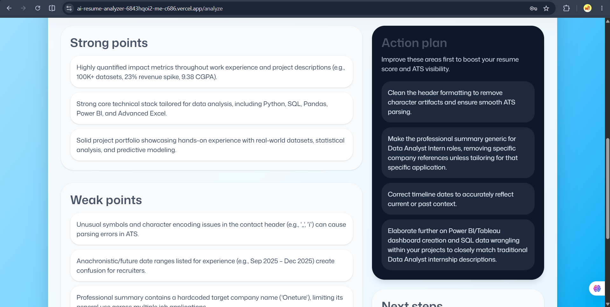
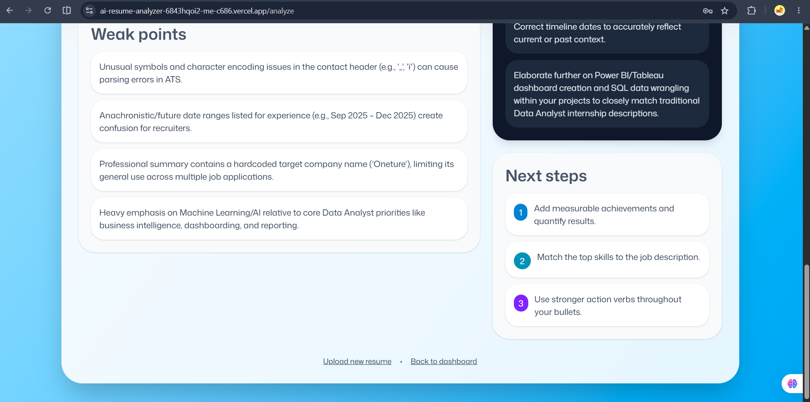
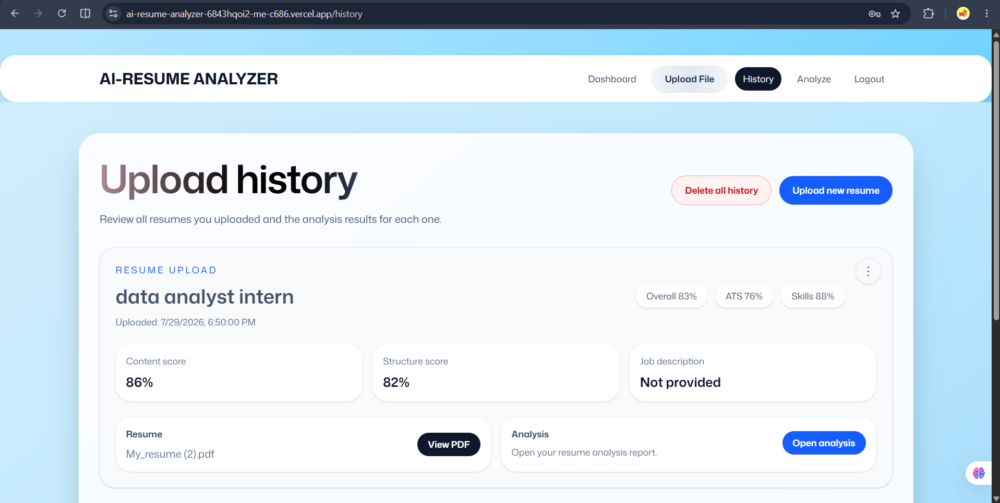

# 🤖 AI Resume Analyzer

An AI-powered full-stack web application that analyzes resumes against job descriptions using **Google Gemini AI**. The application provides ATS compatibility scores, content analysis, skills evaluation, and structure assessment while securely storing users' uploaded resumes and analysis history.


---

## 🌐 Live Demo

🔗 [ https://YOUR-VERCEL-URL.vercel.app](https://ai-resume-analyzer-6843hqoi2-me-c686.vercel.app/)

---

## 📂 GitHub Repository

🔗 [https://github.com/anshika1909singh-sys/ai-resume-analyzer](https://github.com/anshika1909singh-sys/ai-resume-analyzer)

---

# 📖 Overview

Recruiters often spend only a few seconds reviewing a resume. This project helps job seekers evaluate their resumes before applying by providing AI-powered insights and ATS compatibility analysis.

The application allows users to:

- Create an account
- Upload PDF resumes
- Provide a target job title and job description
- Receive AI-generated resume feedback
- View previous resume analyses
- Preview uploaded resumes
- Manage upload history

---

# ✨ Features

### 🔐 Authentication

- User Signup
- User Login
- JWT Authentication
- Password Encryption using bcrypt

### 📄 Resume Management

- PDF Resume Upload
- Secure File Storage
- Resume History
- PDF Preview
- Delete Individual Resume
- Delete Complete History

### 🤖 AI Analysis

- ATS Score
- Overall Resume Score
- Skills Analysis
- Content Quality Analysis
- Resume Structure Analysis
- AI Suggestions using Google Gemini

### 💾 Database

- MongoDB Atlas
- User Management
- Resume Storage
- Analysis History

---

# 🛠 Tech Stack

## Frontend

- React Router 8
- React
- TypeScript
- Tailwind CSS
- Vite

## Backend

- Node.js
- Express.js
- JWT Authentication
- Multer
- PDF Parser
- Google Gemini AI

## Database

- MongoDB Atlas
- Mongoose

## Deployment

- Vercel
- Render

---

# 🏗 Architecture

```text
                +----------------------+
                |      React UI        |
                +----------+-----------+
                           |
                           |
                    REST API Requests
                           |
                           v
                +----------------------+
                |    Express Backend   |
                +----------+-----------+
                           |
         +-----------------+----------------+
         |                                  |
         |                                  |
         v                                  v
 +--------------------+           +-------------------+
 |   MongoDB Atlas    |           |   Google Gemini   |
 +--------------------+           +-------------------+
```

---
## ⭐ Key Highlights

- 🤖 AI-powered resume analysis using Google Gemini
- 📄 PDF upload and parsing
- 🔐 Secure JWT authentication
- 📊 ATS compatibility scoring
- 📁 Resume history with PDF preview
- ☁️ Deployed on Vercel and Render

---

# 📷 Screenshots

## Login



---

## Dashboard



---

## Upload Resume



---

## AI Analysis



---

## AI Analysis Action Plan



---

## Upload History



---

# ⚙ Installation

## Clone Repository

```bash
git clone https://github.com/YOUR-GITHUB-USERNAME/ai-resume-analyzer.git
```

---

## Install Frontend

```bash
npm install
```

---

## Install Backend

```bash
cd backend
npm install
```

---

## Frontend Environment Variables

Create a `.env` file in the project root.

```env
VITE_API_URL=http://localhost:5000
```

---

## Backend Environment Variables

Create a `.env` file inside the `backend` folder.

```env
PORT=5000

MONGODB_URI=YOUR_MONGODB_CONNECTION_STRING

JWT_SECRET=YOUR_SECRET_KEY

GEMINI_API_KEY=YOUR_GEMINI_API_KEY
```

---

## Run Frontend

```bash
npm run dev
```

---

## Run Backend

```bash
cd backend
npm run dev
```

---

# 📁 Folder Structure

```
AI-Resume-Analyzer/

├── app/
├── public/
├── backend/
│   ├── controllers/
│   ├── middleware/
│   ├── models/
│   ├── routes/
│   ├── uploads/
│   └── server.js
│
├── package.json
├── vite.config.ts
└── README.md
```

---

# 🚀 Future Improvements

- Resume comparison
- Downloadable AI report
- Multiple resume versions
- Role-specific AI optimization
- Dark mode
- Email verification
- Password reset
- Resume templates
- Interview preparation suggestions

---

# 📚 What I Learned

During this project I gained practical experience with:

- Full Stack Development
- REST API Design
- JWT Authentication
- MongoDB Atlas
- File Upload using Multer
- PDF Parsing
- AI API Integration
- React Router Framework
- Environment Variables
- Production Deployment
- Git & GitHub
- Debugging Production Issues

---

# 🤝 Contributing

Contributions, suggestions, and feature requests are welcome.

Feel free to fork this repository and submit a pull request.

---

# 📄 License

This project is licensed under the MIT License.

---

# 👨‍💻 Author

**Anshika Singh**

GitHub:
https://github.com/anshika1909singh-sys

LinkedIn:
https://linkedin.com/in/www.linkedin.com/in/anshika-singh-b3901b348
